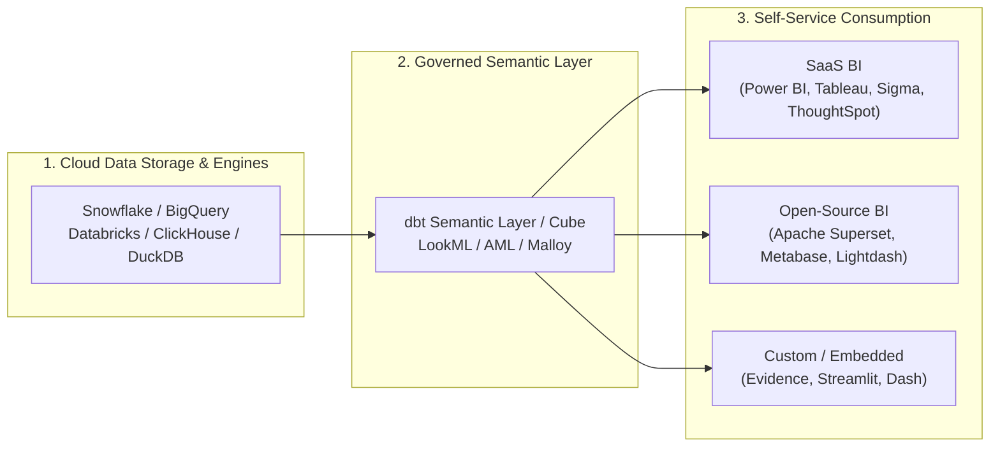

# 🚀 Awesome-Self-Service-BI

  

  
  
  
  
  
  

---

## 🌟 Top Self-Service BI Platforms & Analytics Ecosystem

> **A curated, SEO-optimized directory of SaaS Business Intelligence platforms, modern open-source BI engines, semantic layers, and generative AI analytics tools.**

*Targeted at Analytics Engineers, Data Leaders, BI Developers, and Business Teams building Governed Metrics, Ad-Hoc Data Exploration, Embedded Dashboards, and Modern Data Stack (MDS) architectures.*

📅 **Last updated: September 2026**

---

## 📖 Table of Contents

- [💡 Overview & Key Concepts](#-overview--key-concepts)
- [🏢 SaaS & Hosted Platforms](#-saashosted-platforms)
  - [📊 Market Size & Industry Structure](#-market-size--industry-structure)
  - [📋 SaaS Comparison Table](#-saas-comparison-table)
- [🔓 Open-Source GitHub Projects](#-open-source-github-projects)
- [🛠️ Architecture Patterns & Best Practices](#-architecture-patterns--best-practices)
- [⭐ Star History](#-star-history)
- [🤝 How to Contribute](#-how-to-contribute)
- [📜 Disclaimer](#-disclaimer)

---

## 💡 Overview & Key Concepts

**Self-Service Business Intelligence (BI)** enables non-technical decision makers, finance analysts, and product managers to autonomously query data, build interactive dashboards, and derive reliable insights without constantly relying on overloaded data engineering teams.

Key architectural pillars of modern Self-Service BI:
- **🗂️ Governed Semantic Layers:** Centralized definitions of business metrics (revenue, churn, ARR) defined once in code (dbt, LookML, Cube, AML) and reused consistently across every report.
- **⚡ Direct Warehouse-Native Queries:** Push-down SQL computation executing directly on Snowflake, Google BigQuery, Databricks, Amazon Redshift, or ClickHouse.
- **🤖 Generative AI & Natural Language Query (NLQ):** Conversational AI agents and LLM copilot interfaces enabling text-to-SQL data exploration.
- **📱 Embedded & Headless Analytics:** Reusable APIs, SDKs, and iframe components for integrating live dashboards into customer-facing applications.

---

## 🏢 SaaS/Hosted Platforms

### 📊 Market Size & Industry Structure

> 🌐 **Market Overview & Competitive Landscape:**  
> The global Business Intelligence and Self-Service Analytics market is estimated at **$33.6 Billion in 2026** (projected to exceed **$60 Billion by 2032 at a ~13.5% CAGR**). The sector exhibits **moderate fragmentation with an oligopolistic core**: legacy enterprise giants and hyperscalers (Microsoft Power BI, Salesforce Tableau, Google Cloud Looker) command over **60% of total enterprise market spend**, while innovative warehouse-native, AI-first, and semantic-focused SaaS challengers (Sigma Computing, ThoughtSpot, Lightdash, Preset, Metabase Cloud) are rapidly consolidating market share within modern data stack organizations.

### 📋 SaaS Comparison Table

*Sorted in descending order by company scale (Valuation / Market Cap / Revenue).*

| Product | Description | Company Scale (Valuation / Revenue) | Starting Pricing | Free Tier / Free Trial Limits |
| :--- | :--- | :--- | :--- | :--- |
| **[Microsoft Power BI](https://powerbi.microsoft.com/)** | Widely adopted enterprise BI suite deeply integrated with Microsoft 365, Azure, and Microsoft Fabric. | **$3.1T Market Cap** (Microsoft / $245B+ Annual Revenue; Enterprise BI revenue ~$5B+) | **Power BI Pro:** $14/user/month (or Fabric Capacity starting from $262.80/month for F2) | **Power BI Desktop Free:** Free forever for individual local use (personal report authoring, 1 GB dataset model size limit, zero cloud sharing/workspace collaboration); **60-day free trial** for Power BI Pro. |
| **[Looker (Google Cloud)](https://cloud.google.com/looker)** | Pioneer of the modeled semantic layer (LookML) — "model once, explore everywhere" with robust enterprise governance. | **$2.1T Market Cap** (Alphabet / $350B+ Annual Revenue; acquired for $2.6B, BI ARR ~$1B+) | **Looker Standard Edition:** $5,000/month platform fee ($60,000/year billed annually) + user licenses; or **Looker Studio Pro:** $9/user/month ($0 platform fee) | **Looker Studio Free:** Free forever for unlimited reports and 500+ data connectors (lacks LookML semantic modeling); **Looker Core:** **30-day free trial** of standard instance with 5,000 row browser rendering limit. |
| **[Tableau Cloud](https://www.tableau.com/)** | Industry-standard visual analytics platform renowned for expressive visualization, dashboarding, and Salesforce integration. | **$300B Market Cap** (Salesforce / $38B+ Annual Revenue; acquired for $15.7B, Tableau ARR ~$2.5B+) | **Standard Creator:** $75/user/month (billed annually; minimum 1 Creator required; Explorer: $42/user/month, Viewer: $15/user/month) | **Tableau Public:** Free forever with 10 GB storage (all published workbooks and datasets must be 100% public); **Tableau Cloud:** **15-day free trial** for cloud web authoring (Tableau Desktop has a separate 14-day trial). |
| **[Qlik Sense](https://www.qlik.com/)** | Associative data engine that supports flexible multi-source exploration and augmented analytics. | **~$10B+ Valuation** (Thoma Bravo PE; ~$1.3B+ Annual Revenue) | **Starter Plan:** $300/month (billed annually, includes 10 users and 10 GB data capacity; +$30/user/month for additional users) | **30-day free trial** of Qlik Cloud Analytics with up to 10 users, 10 GB data capacity, and full dashboard authoring. No free-forever plan. |
| **[ThoughtSpot](https://www.thoughtspot.com/)** | Search- and GenAI-driven analytics platform that lets business users ask questions in natural language against governed data models. | **$4.2B Valuation** (Series F; ~$180M+ ARR) | **Essentials Plan:** $25/user/month (billed annually; up to 50 users & 25M rows) | **14-day free trial** with full platform capabilities, Liveboards, Spotter AI agents, and custom or sample data connections. No free-forever plan. |
| **[Sigma Computing](https://www.sigmacomputing.com/)** | Spreadsheet-native, warehouse-direct analytics popular with finance and operations teams for live exploration and input write-backs. | **$3.0B Valuation** (Series E; ~$100M+ ARR) | **Base Tier:** $17,500/year entry deployment (~$2,000–$3,500/user/year for Creator/Build seats; View licenses lower/included) | **14-day free trial** with cloud data warehouse connection (Snowflake/BigQuery/Databricks) and 1M row export limit; or **Sigma Public** (free forever for public visualizations & datasets). |
| **[GoodData](https://www.gooddata.com/)** | Composable, API-first analytics and metrics platform designed for headless BI and multi-tenant embedded applications. | **~$500M Valuation** (Series E; ~$50M+ ARR) | **Professional Plan:** $1,500/month per workspace (billed annually; includes unlimited users and data queries) | **GoodData Cloud:** **30-day free trial** with full workspace and API access; **GoodData Community Edition:** Free forever self-hosted container up to 5 users. |
| **[Domo](https://www.domo.com/)** | Comprehensive cloud BI and data-apps platform focusing on end-to-end data integration, executive dashboards, and workflows. | **~$350M–$400M Market Cap** (NASDAQ: DOMO; ~$320M Annual Revenue) | **Base Consumption Contract:** $30,000/year (~$2,500/month equivalent) with unlimited user seats | **30-day free trial** with full platform capabilities including data integration, ETL pipelines, AI dashboards, and unlimited users (no credit card required). No free-forever plan. |
| **[Metabase Cloud](https://www.metabase.com/)** | Hosted commercial offering built on open-source Metabase — includes granular data sandboxing, SSO, and audit logging. | **~$300M Valuation** (Series B; ~$25M+ ARR) | **Starter Cloud:** $100/month (includes 5 users; +$6/user/month); **Pro Cloud:** $575/month (includes 10 users; +$12/user/month) | **14-day free trial** for Starter and Pro cloud plans; **Metabase Open Source:** Free forever self-hosted under AGPLv3 with unlimited users (excludes enterprise permissions/SSO). |
| **[Preset](https://preset.io/)** | Fully managed cloud service for Apache Superset with collaborative SQL editor, no-code chart builder, and caching. | **~$150M Valuation** (Series B; ~$10M+ ARR) | **Starter Plan:** $0/month (up to 5 users); **Professional Plan:** $25/user/month (billed monthly; unlimited users, 3 workspaces) | **Starter Free Forever:** Free for up to 5 users, 1 workspace, unlimited charts & dashboards (hibernates after 30 days of inactivity; no SSO or embedded viewer add-ons). |
| **[Holistics](https://www.holistics.io/)** | Code-first BI platform featuring semantic modeling (AML), Git-versioned analytics, and self-service exploration. | **~$50M Valuation** (~$10M+ ARR) | **Entry Plan:** $800/month billed annually ($960/month billed monthly; includes 10 users & 100 reports) | **14-day free trial** with access to AML data modeling, canvas dashboards, and scheduled reports. No free-forever plan. |
| **[Lightdash Cloud](https://www.lightdash.com/)** | Managed dbt-native BI cloud platform featuring governed metrics, self-service exploration, and AI agents. | **~$40M Valuation** (Series A; ~$5M+ ARR) | **Cloud Starter:** $800/month (includes unlimited users and dbt semantic integration) | **21-day free trial** of Cloud Pro with full dbt semantic layer and unlimited users; **Lightdash Open Source:** Free forever self-hosted with unlimited users. |

---

## 🔓 Open-Source GitHub Projects

*Curated open-source Business Intelligence platforms, semantic layers, and interactive analytics engines. Sorted in descending order by GitHub Star count.*

1. **[Grafana](https://github.com/grafana/grafana)**   
   📈 The open and composable observability and data visualization platform. Visualizes metrics, logs, and traces from 100+ data sources, increasingly adopted for real-time operational and business metric dashboards.

2. **[Apache Superset](https://github.com/apache/superset)**   
   🚀 Leading enterprise-ready open-source (Apache 2.0) data exploration and visualization platform. Offers an intuitive no-code chart builder, high-performance SQL Lab, semantic dataset layers, granular security filters, and cloud-native scaling.

3. **[Metabase](https://github.com/metabase/metabase)**   
   🎯 The easiest, most popular way for everyone in an organization to ask questions and learn from data. Features a friendly visual query builder, instant drill-downs, automated email/Slack alerts, and simple Docker/JAR deployment.

4. **[Streamlit](https://github.com/streamlit/streamlit)**   
   🐍 Faster way to build and share custom self-service data apps and interactive analytical dashboards in pure Python without frontend development.

5. **[Redash](https://github.com/getredash/redash)**   
   🔍 Lightweight, developer-friendly open-source tool for querying databases with SQL, creating rich visualizations, sharing interactive dashboards, and automating scheduled reports.

6. **[Plotly Dash](https://github.com/plotly/dash)**   
   📊 Production-grade framework for building analytical web applications, interactive scientific dashboards, and self-service reporting in Python, R, and Julia.

7. **[Cube](https://github.com/cube-js/cube)**   
   🧱 Universal semantic layer and headless BI engine. Provides data modeling, access control, caching pre-aggregations, and SQL/REST/GraphQL APIs to power self-service BI and embedded applications.

8. **[PyGWalker](https://github.com/Kanaries/pygwalker)**   
   🎨 Turns pandas/polars dataframes into a Tableau-like visual exploration UI directly inside Jupyter Notebooks and Streamlit apps with zero setup.

9. **[Evidence](https://github.com/evidence-dev/evidence)**   
   📝 Code-based Business Intelligence framework for building publication-quality data products and reports using Markdown and SQL, managed via version control and Git.

10. **[Apache Zeppelin](https://github.com/apache/zeppelin)**   
    📓 Web-based notebook that enables data-driven, interactive data analytics and collaborative document creation with SQL, Scala, Python, and Apache Spark.

11. **[Lightdash](https://github.com/lightdash/lightdash)**   
    ⚡ Open-source, dbt-native self-service BI platform. Converts your existing dbt metrics and models into an intuitive self-service exploration UI with governed dashboards and AI assistance.

12. **[Rill](https://github.com/rilldata/rill)**   
    ⏱️ Fast, code-first BI and metrics layer engineered for high-cardinality operational data and real-time DuckDB/ClickHouse powered dashboards.

13. **[Malloy](https://github.com/malloydata/malloy)**   
    🔮 Experimental open-source data modeling and query language created by the founders of Looker, designed to compile rich semantic calculations into optimized SQL.

14. **[Helical Insight](https://github.com/helicalinsight/helicalinsight)**   
    🧩 Open-source Java-based BI framework offering ad-hoc reporting, dashboards, rule engines, and API embedding capabilities.

---

## 🛠️ Architecture Patterns & Best Practices

### Key Recommendations for Modern Teams:
- 💡 **Fastest Path to Non-Technical Adoption:** Start with **Metabase** or **Power BI** for intuitive click-and-drag filtering and visual query authoring.
- 🚀 **Full Open-Source Flexibility & Scaling:** Choose **Apache Superset** for enterprise-grade RBAC, SQL Lab, and rich chart customization without license lock-in.
- ⚡ **dbt-Centric Metric Governance:** Standardize on **Lightdash** or **Cube** so your data team maintains one single source of truth in git-versioned YAML.
- 📑 **Spreadsheet-Native Power Users:** Deploy **Sigma Computing** to empower finance and operational users to explore billions of live warehouse rows with Excel formulas and write-back.
- 🔍 **AI-First & Search Querying:** Utilize **ThoughtSpot** or modern LLM agents for conversational Natural Language Querying (NLQ).

---

## ⭐ Star History

---

## 🤝 How to Contribute

1. 🍴 Fork the repository on GitHub.
2. 🌿 Create a new feature branch (`git checkout -b feature/add-tool`).
3. ✏️ Add or update entries in [README.md](file:///C:/Users/ishan/Documents/Projects/Awesome-Self-Service-BI/README.md) following the structured format (include name, links, description, pricing/scale, and star badges).
4. 🚀 Submit a Pull Request with a clear explanation of your additions.

⭐ **Star the repo** if you find it helpful for navigating the Self-Service BI ecosystem!

---

## 📜 Disclaimer

- This is a **community-curated list** created for educational and informational purposes — it does not constitute formal procurement or analytics advice.
- Self-service BI surfaces business-critical metrics across organizations. Always implement strict role-based access control (RBAC), row-level security (RLS), metric validation tests, and audit logging before giving broad user access.

---

  Made with ❤️ for analytics engineers, data leaders, and business teams who want answers without waiting in the report queue.

