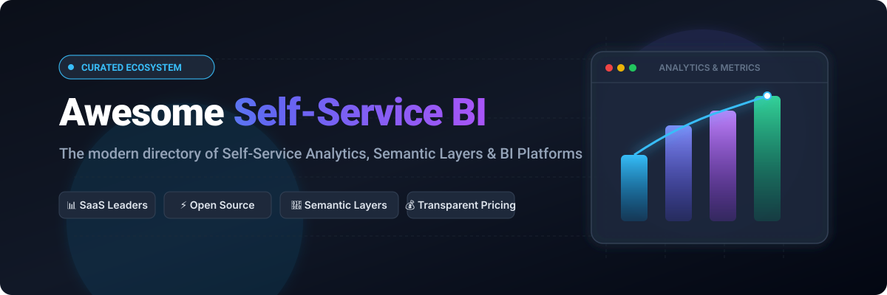

# Awesome-Self-Service-BI

  

## Top Self-Service BI Platforms Ecosystem

**Curated List of SaaS Products & Open-Source GitHub Projects**

*Focused on Governed Metrics, Ad-Hoc Exploration, Dashboards, Semantic Layers & Business-User Analytics*

**Last updated: September 2026**

This repository tracks notable **SaaS platforms** and **open-source projects** for **Self-Service Business Intelligence**. These tools let business users explore data, build dashboards, and answer questions with governed metrics — while data teams retain control via semantic layers, models, and permissions.

**Examples** include ThoughtSpot, Sigma Computing, Looker, Power BI, Qlik Sense, Tableau Cloud, GoodData, Domo, Metabase Enterprise, and Holistics (the category leaders).

**Open-source emphasis**: Self-service BI has mature, widely adopted open options. **Apache Superset**, **Metabase**, **Lightdash**, **Redash**, and related projects deliver production-ready exploration, dashboards, and (in some cases) dbt-native semantic layers. This section is heavily expanded with these tools.

Contributions welcome! Open a PR to add/update entries. Keep descriptions factual and link to official sites.

## Table of Contents

- [SaaS/Hosted Platforms](#saas-products)

- [Open-Source GitHub Projects](#open-source-github-projects)

- [How to Contribute](#how-to-contribute)

- [Disclaimer](#disclaimer)

## SaaS/Hosted Platforms

| Product | Description | Starting Pricing | Free Tier / Free Trial Limits |
| :--- | :--- | :--- | :--- |
| **[ThoughtSpot](https://www.thoughtspot.com/)** | Search- and AI-driven analytics platform that lets business users ask questions in natural language against governed data models. | **Essentials Plan:** $25/user/month (billed annually; up to 50 users & 25M rows) | **14-day free trial** with full platform capabilities, Liveboards, Spotter AI agents, and custom or sample data connections. No free-forever plan. |
| **[Sigma Computing](https://www.sigmacomputing.com/)** | Spreadsheet-style, warehouse-native analytics popular with finance and operations teams for live exploration and input tables. | **Base Tier:** $17,500/year entry deployment (~$2,000–$3,500/user/year for Creator/Build seats; View licenses lower/included) | **14-day free trial** with cloud data warehouse connection (Snowflake/BigQuery/Databricks) and 1M row export limit; or **Sigma Public** (free forever for public visualizations & datasets). |
| **[Looker (Google Cloud)](https://cloud.google.com/looker)** | Pioneer of the modeled semantic layer (LookML) — “model once, explore everywhere” with strong governance and embedding. | **Looker Standard Edition:** $5,000/month platform fee ($60,000/year billed annually) + user licenses; or **Looker Studio Pro:** $9/user/month ($0 platform fee) | **Looker Studio Free:** Free forever for unlimited reports and 500+ data connectors (lacks LookML semantic modeling); **Looker Core:** **30-day free trial** of standard instance with 5,000 row browser rendering limit. |
| **[Microsoft Power BI](https://powerbi.microsoft.com/)** | Widely adopted self-service and enterprise BI platform tightly integrated with the Microsoft ecosystem (Excel, Fabric, Azure). | **Power BI Pro:** $14/user/month (or Fabric Capacity starting from $262.80/month for F2) | **Power BI Desktop Free:** Free forever for individual local use (personal report creation, 1 GB dataset model size limit, zero cloud sharing/workspace collaboration); **60-day free trial** for Power BI Pro. |
| **[Qlik Sense](https://www.qlik.com/)** | Associative analytics engine that supports flexible exploration across complex, multi-source data models. | **Starter Plan:** $300/month (billed annually, includes 10 users and 10 GB data capacity; +$30/user/month for additional users) | **30-day free trial** of Qlik Cloud Analytics with up to 10 users, 10 GB data capacity, and full dashboard authoring. No free-forever plan. |
| **[Tableau Cloud](https://www.tableau.com/)** | Leading visual analytics platform known for rich visualizations, interactive dashboards, and broad connectivity. | **Standard Creator:** $75/user/month (billed annually; minimum 1 Creator required; Explorer: $42/user/month, Viewer: $15/user/month) | **Tableau Public:** Free forever with 10 GB storage (all published workbooks and data must be 100% public); **Tableau Cloud:** **15-day free trial** for cloud web authoring (Tableau Desktop has a separate 14-day trial). |
| **[GoodData](https://www.gooddata.com/)** | Composable, API-first analytics and metrics platform often used for embedded and headless BI use cases. | **Professional Plan:** $1,500/month per workspace (billed annually; includes unlimited users and data queries) | **GoodData Cloud:** **30-day free trial** with full workspace and API access; **GoodData Community Edition:** Free forever self-hosted container up to 5 users. |
| **[Domo](https://www.domo.com/)** | Cloud BI and data-app platform focused on executive dashboards, data integration, and business-user experiences. | **Base Consumption Contract:** $30,000/year (~$2,500/month equivalent) with unlimited user seats | **30-day free trial** with full platform capabilities including data integration, ETL pipelines, AI dashboards, and unlimited users (no credit card required). No free-forever plan. |
| **[Metabase Cloud](https://www.metabase.com/)** | Commercial offering built on the popular open-source Metabase core — adds advanced permissions, SSO, and support. | **Starter Cloud:** $100/month (includes 5 users; +$6/user/month); **Pro Cloud:** $575/month (includes 10 users; +$12/user/month) | **14-day free trial** for Starter and Pro cloud plans; **Metabase Open Source:** Free forever self-hosted under AGPLv3 with unlimited users (excludes enterprise permissions/SSO). |
| **[Holistics](https://www.holistics.io/)** | Code-first / analytics-engineering oriented BI with modeling, self-service exploration, and strong data-team workflows. | **Entry Plan:** $800/month billed annually ($960/month billed monthly; includes 10 users & 100 reports) | **14-day free trial** with access to AML data modeling, canvas dashboards, and scheduled reports. No free-forever plan. |
| **[Preset](https://preset.io/)** | Fully managed cloud service for Apache Superset with collaborative SQL editor, no-code chart builder, and caching. | **Starter Plan:** $0/month (up to 5 users); **Professional Plan:** $25/user/month (billed monthly; unlimited users, 3 workspaces) | **Starter Free Forever:** Free for up to 5 users, 1 workspace, unlimited charts & dashboards (hibernates after 30 days of inactivity; no SSO or embedded viewer add-ons). |
| **[Lightdash Cloud](https://www.lightdash.com/)** | Managed dbt-native BI cloud platform featuring governed metrics, self-service exploration, and AI agents. | **Cloud Starter:** $800/month (includes unlimited users and dbt semantic integration) | **21-day free trial** of Cloud Pro with full dbt semantic layer and unlimited users; **Lightdash Open Source:** Free forever self-hosted with unlimited users. |

## Open-Source GitHub Projects

- **[Apache Superset](https://github.com/apache/superset)**  

  Leading fully open-source (Apache 2.0) data exploration and visualization platform — no-code charts, SQL Lab, semantic datasets/metrics, and enterprise-ready features. Self-host or use managed options (e.g. Preset).

- **[Metabase](https://github.com/metabase/metabase)**  

  Most popular open-source BI for non-technical users — visual question builder, dashboards, simple setup (Docker/JAR). Open-core model with paid tiers for advanced permissions and AI.

- **[Lightdash](https://github.com/lightdash/lightdash)**  

  Open-source, dbt-native BI platform — governed metrics from your dbt project, self-service exploration, dashboards, and agentic features. Self-host or use Lightdash Cloud.

- **[Redash](https://github.com/getredash/redash)**  

  Lightweight open-source tool focused on SQL querying, visualizations, and collaborative dashboards — ideal for data-curious teams.

- **[Evidence](https://evidence.dev/)**  

  Code-based (Markdown + SQL) BI and reporting framework for building data products as code.

- **[Rill](https://github.com/rilldata/rill)**  

  Fast, code-first metrics and dashboard tooling aimed at operational and real-time analytics.

- **[Apache Zeppelin / Jupyter-style notebooks](https://zeppelin.apache.org/)**  

  Interactive data science and analytics notebooks that often complement or substitute classic BI for technical users.

- **[Grafana](https://github.com/grafana/grafana)**  

  Open observability and dashboard platform increasingly used for business metrics alongside operational data.

- **[Helical Insight (open-source edition)](https://github.com/helicalinsight/helicalinsight)**  

  Open-source BI platform with reporting, dashboards, and embedding capabilities.

- **[Other community BI & metrics projects](https://github.com/)**  

  Emerging tools and forks that extend semantic layers, embedding, or AI-assisted exploration on open stacks.

### Additional Strong Open-Source Options

- Starting with **Metabase** for the fastest path to non-technical self-service.

- Choosing **Apache Superset** when you need richer visualizations, SQL Lab, and full Apache 2.0 freedom.

- Adopting **Lightdash** if your metrics already live in dbt and you want governed, code-aligned BI.

- Using **Redash** for lightweight SQL-first internal analytics.

- Combining open BI with a warehouse + dbt semantic layer for a modern, low-lock-in stack.

- Adding managed offerings (Preset for Superset, Metabase Cloud, Lightdash Cloud) when you want the open core without operating it yourself.

**Frameworks for building custom systems**: Model metrics in dbt (or equivalent) → serve them through **Lightdash**, **Superset**, or **Metabase** → embed or schedule as needed. This gives governed self-service with full ownership. Commercial platforms (ThoughtSpot, Sigma, Looker, Power BI, Tableau, etc.) still lead in polished AI/search experiences, enterprise governance at massive scale, spreadsheet-native UX, and deep ecosystem integrations.

## How to Contribute

1. Fork the repo.

2. Add/edit entries in `README.md` (follow existing format).

3. Include: name, link, 1–2 sentence description, and whether it's SaaS or open-source.

4. Submit PR with a short explanation.

Star the repo if you find it useful!

## Disclaimer

- This is a **community-curated** list — not exhaustive and not an endorsement.

- Self-service BI surfaces business data to many users. Incorrect metrics or overly broad permissions can lead to bad decisions or data exposure. Open-source deployments require proper authentication, row-level security, auditing, and backup practices. Always align metric definitions with finance and data-governance stakeholders.

- This list is not analytics or data-governance advice.

---

**Made for analytics engineers, data teams, and business users who want answers without waiting in the report queue.**

Let's keep metrics governed, exploration open, and insights in the hands of the people who need them.
